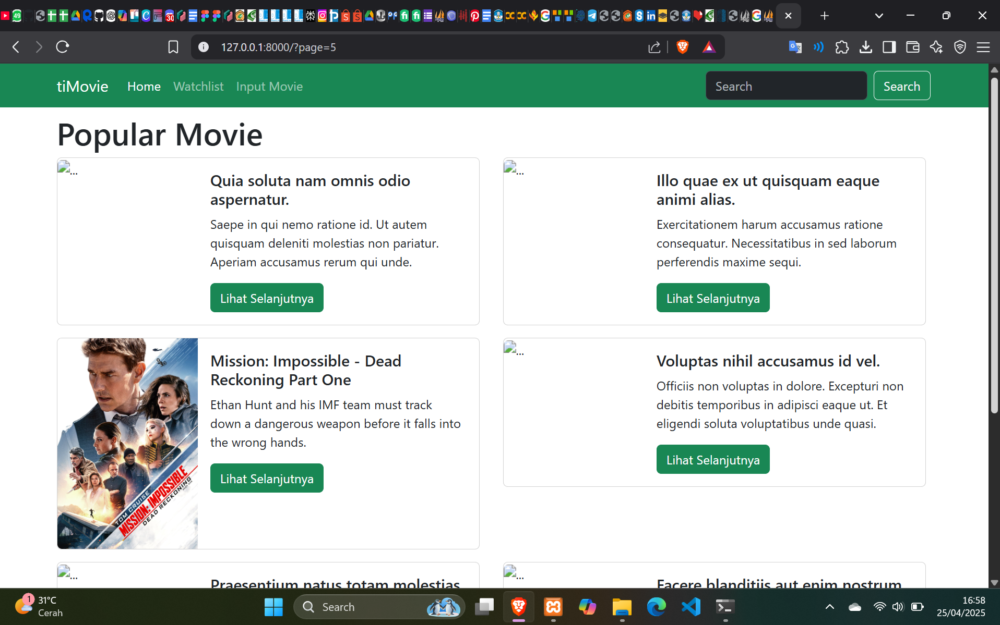

# Movie Management System

This project is a movie management system built using Laravel and Blade templates. The application allows users to manage movie data, including adding, editing, and deleting movies, as well as viewing movie details.

## Features
- Display a list of movies with pagination.
- View detailed information of each movie.
- Add new movies with images and categories.
- Edit and update existing movie details.
- Delete movies with a confirmation prompt.

## Refactoring Completed
I have successfully refactored the following files:
1. **`data-movies.blade.php`** - Optimized and cleaned up the code for displaying the movie list.
2. **`movie-detail.blade.php`** - Refactored the code for displaying detailed movie information.
3. **`edit-movie.blade.php`** - Improved the form for editing movie data.
4. **`homepage.blade.php`** - Streamlined the homepage layout for displaying popular movies.
5. **`create-movie.blade.php`** - Cleaned up the movie creation form.

The code refactoring aimed to improve readability, maintainability, and remove unnecessary comments, making it easier to work with.

## Screenshot of the Application
Here is a screenshot of the application after the refactoring:



## Installation

To install and run this application locally:

1. Clone the repository:
    ```bash
    git clone https://github.com/yourusername/movie-management.git
    ```

2. Navigate to the project directory:
    ```bash
    cd movie-management
    ```

3. Install the dependencies using Composer:
    ```bash
    composer install
    ```

4. Set up your `.env` file (copy `.env.example` to `.env`):
    ```bash
    cp .env.example .env
    ```

5. Generate the application key:
    ```bash
    php artisan key:generate
    ```

6. Run the database migrations:
    ```bash
    php artisan migrate
    ```

7. Serve the application:
    ```bash
    php artisan serve
    ```

Visit `http://localhost:8000` in your browser to see the application in action.

## License

This project is licensed under the MIT License - see the [LICENSE](LICENSE) file for details.
